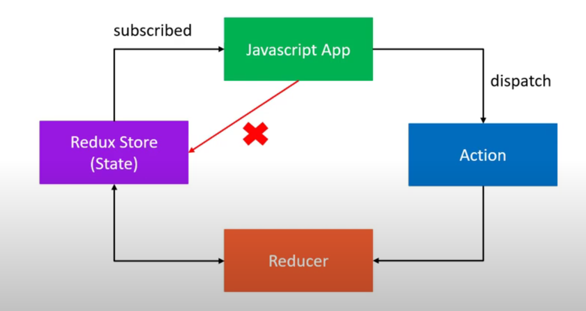

# What is Redux

Redux is a predictable state container for JavaScript apps
Redux is a library for managing state in a predictable way in JavaScript applications

## Installation

To initialise a package.json with the default settings
```bash
npm init --yes
```
Adding redux as a dependencies
```bash
npm install redux
```
## Usage

To run the code "index" is the name of the JS file
```bash
node index
```

## Three Core Concepts

- Store : Holds the state of your applciation
- Action : Describes what happened in the application
- Reducer : Ties the store and actions together (handles the action and decides how to update the state)

## Three Principles

- Maintain our application state in a single object which would be managed by the Redux store
- To update the state of your app, you need to let Redux know about that with an action. Not allowed to directly update the state object.

This is a action in code 
```javascript
{
    type: `Action`
}
```
-  To specify how the state tree is updated based on actions, you write pure reducers
Reducer - (previousState,action) => newState

